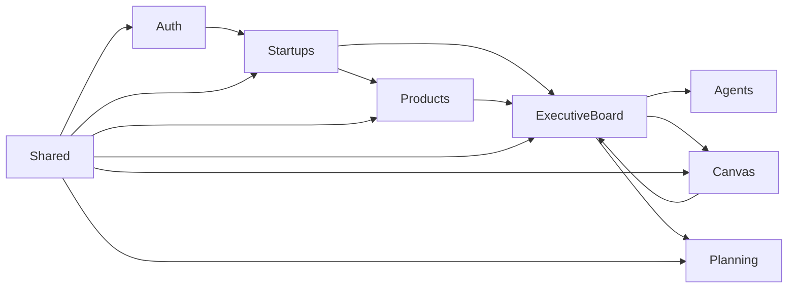
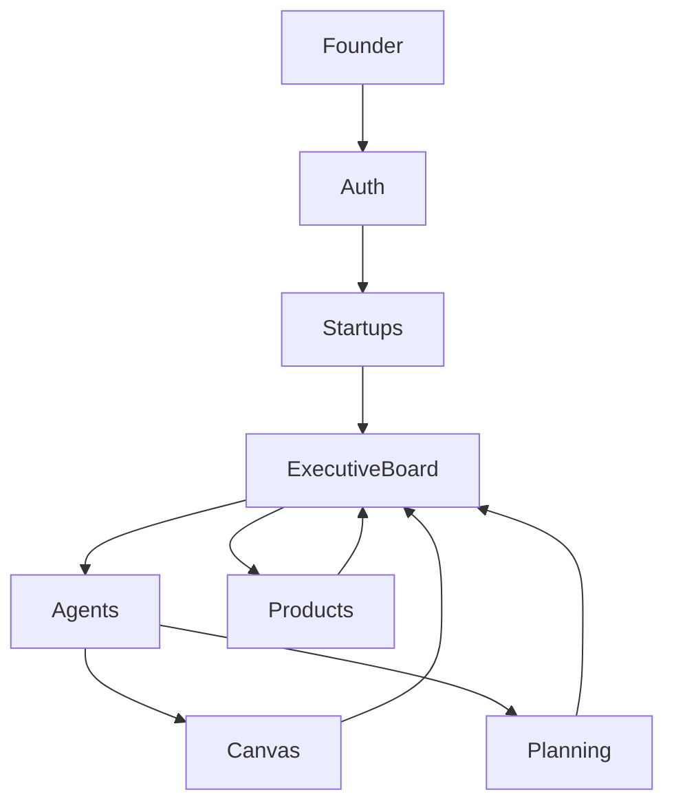

# Módulos do Sistema

> **Documento:** Modules
> **Versão:** 1.0
> **Status:** MVP v1

---

# Objetivo

Este documento descreve a organização dos módulos que compõem o MetaValley.

Cada módulo representa um domínio de negócio independente, possuindo responsabilidades bem definidas e baixo acoplamento com os demais módulos.

Embora a aplicação seja implantada como um único serviço (Monólito Modular), a separação em módulos permite evolução incremental e futura extração para microsserviços, caso necessário.

---

# Princípios

Cada módulo deve possuir:

* responsabilidade única;
* regras de negócio próprias;
* casos de uso independentes;
* entidades próprias;
* interfaces públicas;
* acesso ao banco apenas através de repositórios.

É proibido acessar diretamente a implementação interna de outro módulo.

A comunicação deve ocorrer através de interfaces, serviços de aplicação ou eventos internos.

---

# Visão Geral

```text
MetaValley

├── Auth
├── Startups
├── Products
├── Executive Board
├── Agents
├── Canvas
├── Planning
├── Simulation
└── Shared
```

---

# Dependências entre Módulos



A dependência sempre deve apontar para módulos mais centrais do domínio.

---

# Auth

## Objetivo

Gerenciar autenticação e autorização dos usuários da plataforma.

A implementação utiliza o Supabase Auth, conforme definido para o MVP.

---

## Responsabilidades

* Login
* Cadastro
* Recuperação de senha
* Sessão
* Controle de autenticação
* Identificação do founder

---

## Casos de Uso

* SignIn
* SignUp
* SignOut
* ForgotPassword
* RefreshSession

---

## Entidades

* User

---

## Dependências

Não depende de nenhum módulo de negócio.

---

## Consumidores

* Startups
* Executive Board
* Canvas
* Planning
* Products

---

# Startups

## Objetivo

Representa o domínio principal da plataforma.

Toda informação do sistema é organizada em torno de uma Startup.

O fluxo de criação via conversa está descrito nos requisitos do MVP.

---

## Responsabilidades

* Criar startup
* Editar startup
* Selecionar startup ativa
* Gerenciar múltiplas startups
* Gerenciar contexto principal

---

## Casos de Uso

* CreateStartup
* UpdateStartup
* DeleteStartup
* SelectStartup
* ListUserStartups

---

## Entidades

* Startup

---

## Regras Importantes

Toda requisição do sistema deve possuir uma Startup Ativa.

Nenhum outro módulo deve armazenar contexto próprio da startup.

---

# Products

## Objetivo

Gerenciar os produtos pertencentes a uma Startup.

Cada startup pode possuir diversos produtos, utilizados como contexto pelos agentes.

---

## Responsabilidades

* Criar produto
* Atualizar produto
* Excluir produto
* Listar produtos

---

## Casos de Uso

* CreateProduct
* UpdateProduct
* DeleteProduct
* ListProducts

---

## Entidades

* Product

---

## Dependências

Depende apenas do módulo Startups.

---

# Executive Board

## Objetivo

Representa o núcleo funcional do MetaValley.

É responsável pela orquestração das conversas entre founder e agentes.

Todo o fluxo do Board Executivo descrito nos requisitos pertence a este módulo.

---

## Responsabilidades

* Chat em grupo
* Chat individual
* Histórico
* Streaming
* Orquestração dos agentes
* Persistência das mensagens

---

## Casos de Uso

* SendMessage
* LoadConversation
* StreamResponse
* LoadHistory

---

## Entidades

* Conversation
* Message

---

## Dependências

* Agents
* Canvas
* Products
* Startups

---

# Agents

## Objetivo

Centralizar toda a inteligência relacionada aos agentes de IA.

Este módulo não conhece HTTP nem interface gráfica.

Sua única responsabilidade é gerar comportamento para os agentes.

---

## Responsabilidades

* Construção dos prompts
* Recuperação do contexto
* Seleção dos agentes participantes
* Comunicação com LLM
* Processamento das respostas

---

## Casos de Uso

* BuildContext
* GenerateResponse
* SelectAgents
* ExecuteConversation

---

## Entidades

* Agent
* AgentProfile

---

## Agentes

* CEO
* CTO
* CFO
* CMO

Cada agente possui:

* personalidade;
* especialidade;
* prompt base;
* contexto compartilhado.

---

# Canvas

## Objetivo

Representa o conhecimento estruturado da startup.

O Canvas é atualizado automaticamente a partir das conversas dos agentes, conforme definido nos requisitos do MVP.

---

## Responsabilidades

* Atualizar zonas
* Versionar alterações
* Fornecer contexto aos agentes
* Exportação

---

## Casos de Uso

* UpdateCanvas
* LoadCanvas
* ExportCanvas
* RestoreVersion

---

## Entidades

* Canvas
* CanvasZone

---

# Planning

## Objetivo

Gerenciar os próximos passos sugeridos pelos agentes.

---

## Responsabilidades

* Criar tarefas
* Concluir tarefas
* Listar planejamento
* Histórico

---

## Casos de Uso

* CreatePlanningItem
* CompletePlanningItem
* ListPlanningItems

---

## Entidades

* PlanningItem

---

# Simulation

## Objetivo

Representar o módulo responsável pela Simulação TME.

No MVP sua responsabilidade é apenas apresentar a tela teaser e armazenar interessados.

---

## Responsabilidades

* Capturar interessados
* Exibir tela teaser

---

## Casos de Uso

* RegisterInterest
* ListInterests

---

## Entidades

* SimulationInterest

---

# Shared

## Objetivo

Centralizar componentes reutilizáveis da aplicação.

Este módulo **não contém regras de negócio**.

---

## Responsabilidades

* Exceptions
* Value Objects
* Helpers
* Configurações
* Logging
* Eventos
* Interfaces comuns
* Utilitários

---

# Comunicação entre Módulos

A comunicação deve seguir as seguintes regras:

✅ Permitido

* chamadas por interfaces;
* serviços de aplicação;
* eventos internos;
* DTOs.

❌ Não permitido

* acesso direto ao banco de outro módulo;
* importação de entidades internas;
* compartilhamento de repositórios;
* dependências circulares.

---

# Fluxo Geral dos Módulos



---

# Evolução Esperada

Conforme o crescimento da plataforma, alguns módulos possuem maior probabilidade de serem extraídos para serviços independentes.

| Módulo          | Prioridade |
| --------------- | ---------: |
| Agents          |       Alta |
| Executive Board |       Alta |
| Canvas          |      Média |
| Simulation      |      Média |
| Planning        |      Baixa |
| Products        |      Baixa |
| Auth            |      Baixa |

A extração ocorrerá apenas quando houver necessidade de escalabilidade ou autonomia operacional.

---

# Resumo

A divisão em módulos busca refletir os domínios naturais do MetaValley, evitando acoplamento entre funcionalidades e permitindo evolução incremental da plataforma.

Cada módulo possui fronteiras claras, responsabilidades bem definidas e comunica-se apenas através de contratos públicos, mantendo a arquitetura organizada e preparada para o crescimento do produto.
