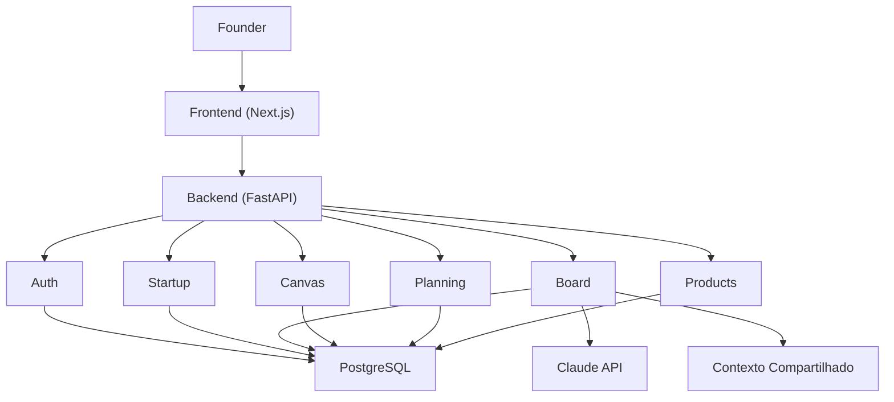
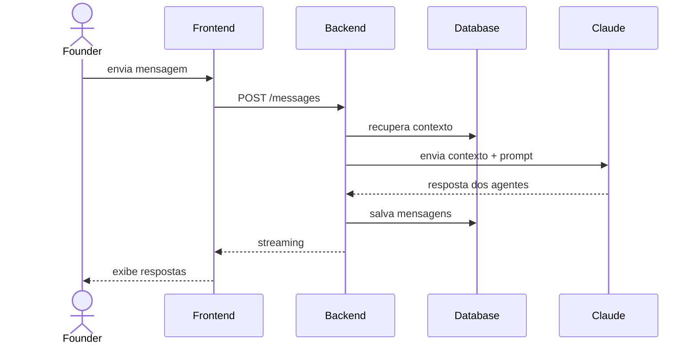

# Visão Geral da Arquitetura

> **Documento:** System Overview
> **Versão:** 1.0
> **Status:** MVP v1

---

# Objetivo

Este documento apresenta a visão arquitetural do **MetaValley**, descrevendo os principais componentes do sistema, seus relacionamentos, responsabilidades e princípios de funcionamento.

O objetivo é fornecer uma visão de alto nível da solução, permitindo que qualquer desenvolvedor compreenda rapidamente:

* como o sistema está organizado;
* quais são seus principais módulos;
* como ocorre o fluxo das informações;
* quais integrações externas existem;
* como a arquitetura poderá evoluir.

Este documento não descreve detalhes de implementação. Esses detalhes encontram-se nos documentos específicos de arquitetura do backend e dos módulos.

---

# Visão do Produto

O MetaValley é uma plataforma SaaS que auxilia founders na validação e evolução de startups através de um conselho executivo composto por agentes especializados de Inteligência Artificial.

Diferentemente de um chatbot tradicional, o produto é orientado ao contexto da startup do usuário, permitindo que diferentes agentes colaborem, debatam e construam conhecimento compartilhado ao longo do tempo.

Durante toda a utilização da plataforma, as conversas alimentam automaticamente um **Canvas Vivo**, que representa o estado atual do negócio e serve como contexto para futuras interações.

## Essa visão está alinhada ao levantamento de requisitos do MVP, que descreve o Board Executivo, os agentes especializados, o Canvas Vivo e a futura Simulação TME como pilares do produto.

# Objetivos Arquiteturais

A arquitetura foi concebida para atender aos seguintes objetivos:

* entregar rapidamente um MVP funcional;
* manter baixo custo operacional;
* facilitar manutenção e evolução do código;
* permitir crescimento gradual da plataforma;
* reduzir acoplamento entre funcionalidades;
* possibilitar futura migração para arquitetura distribuída.

---

# Estilo Arquitetural

O MetaValley adota uma arquitetura baseada em um **Monólito Modular**.

Embora toda a aplicação seja implantada como um único serviço, sua organização interna é dividida em módulos independentes de domínio.

Essa abordagem foi escolhida porque:

* simplifica o deploy;
* reduz custos de infraestrutura;
* acelera o desenvolvimento;
* facilita testes;
* evita complexidade prematura.

Cada módulo possui responsabilidades bem definidas e comunica-se com os demais apenas por contratos públicos.

---

# Visão Geral da Solução



---

# Componentes da Plataforma

A plataforma é composta pelos seguintes componentes principais.

## Frontend

Responsável pela interface utilizada pelo founder.

Principais responsabilidades:

* autenticação;
* dashboard;
* chats;
* Canvas Vivo;
* planejamento;
* gerenciamento de startups;
* gerenciamento de produtos.

---

## Backend

Centraliza toda a lógica de negócio da plataforma.

Responsabilidades:

* autenticação;
* gerenciamento das startups;
* gerenciamento das conversas;
* persistência dos dados;
* atualização automática do Canvas;
* gerenciamento do contexto compartilhado;
* comunicação com serviços externos.

---

## Banco de Dados

Responsável pelo armazenamento persistente de:

* usuários;
* startups;
* produtos;
* conversas;
* mensagens;
* canvas;
* planejamento;
* interesses em simulação.

Sua estrutura inicial está descrita no levantamento de requisitos.

---

## Claude API

Responsável pela geração das respostas dos agentes.

Cada agente possui identidade própria e recebe contexto específico da startup ativa antes da geração das respostas.

---

# Fluxo Geral da Aplicação



---

# Fluxo de Contexto

Todo o funcionamento do MetaValley gira em torno da **Startup Ativa**.

Cada requisição realizada pelo founder considera:

* startup selecionada;
* histórico da conversa;
* Canvas Vivo;
* produtos cadastrados;
* planejamento existente.

Isso garante que todas as respostas permaneçam coerentes com a realidade daquela startup específica.

---

# Contexto Compartilhado

Uma característica central da plataforma é o compartilhamento de contexto entre agentes.

Quando um agente atualiza uma informação relevante, ela passa a compor o contexto da startup.

No turno seguinte, todos os demais agentes passam a utilizar essas informações automaticamente.

Exemplos:

* atualização do Canvas;
* criação de produto;
* mudança de estágio da startup;
* novos aprendizados durante a conversa.

## Esse comportamento está previsto nas regras de negócio do Board Executivo e do Canvas Vivo.

# Organização em Domínios

O sistema é dividido em domínios independentes.

```text
Auth

Startups

Products

Executive Board

Agents

Canvas

Planning

Simulation

Shared
```

Cada domínio encapsula:

* regras de negócio;
* entidades;
* casos de uso;
* infraestrutura;
* interfaces públicas.

Nenhum domínio pode acessar diretamente a implementação interna de outro.

---

# Integrações Externas

O MetaValley depende de alguns serviços externos.

| Serviço        | Responsabilidade        |
| -------------- | ----------------------- |
| Supabase Auth  | Autenticação            |
| PostgreSQL     | Persistência            |
| Claude API     | Inteligência Artificial |
| Sentry         | Monitoramento           |
| Vercel         | Deploy do Frontend      |
| Railway/Render | Deploy do Backend       |

As tecnologias utilizadas seguem a stack definida para o MVP.

---

# Princípios Arquiteturais

Toda implementação deve respeitar os seguintes princípios.

## Orientação ao Domínio

As regras de negócio são independentes do framework.

---

## Separação de Responsabilidades

Cada módulo possui responsabilidade única.

---

## Baixo Acoplamento

Módulos interagem apenas por contratos.

---

## Alta Coesão

Tudo que pertence ao mesmo domínio permanece no mesmo módulo.

---

## Evolução Incremental

Novas funcionalidades devem ser adicionadas sem necessidade de grandes refatorações.

---

## Simplicidade

A arquitetura prioriza soluções simples enquanto o produto estiver em fase de validação.

---

# Limitações do MVP

Nesta primeira versão, algumas decisões foram tomadas para reduzir a complexidade.

* uma única API;
* um único banco de dados;
* deploy único;
* comunicação síncrona entre módulos;
* processamento de IA diretamente pelo backend;
* ausência de filas e processamento assíncrono.

Essas limitações são intencionais e compatíveis com a estratégia do MVP.

---

# Evolução Arquitetural

A arquitetura deverá evoluir conforme o crescimento da plataforma.

```text
MVP

↓

Monólito Modular

↓

Escalabilidade Horizontal

↓

Workers

↓

Filas

↓

Arquitetura Híbrida

↓

Microsserviços
```

A migração para microsserviços somente ocorrerá quando existir necessidade comprovada de escalabilidade, independência operacional ou especialização de equipes.

---

# Relação com os Demais Documentos

Este documento apresenta apenas a visão geral da solução.

Para aprofundar o entendimento da arquitetura, consulte:

| Documento                 | Conteúdo                                     |
| ------------------------- | -------------------------------------------- |
| `modules.md`              | Organização dos domínios e responsabilidades |
| `backend-architecture.md` | Estrutura interna do backend                 |
| `scalability.md`          | Estratégia de crescimento da arquitetura     |

Juntos, esses documentos descrevem a arquitetura do MetaValley em diferentes níveis de abstração, permitindo compreender tanto a visão macro quanto os detalhes de implementação.
